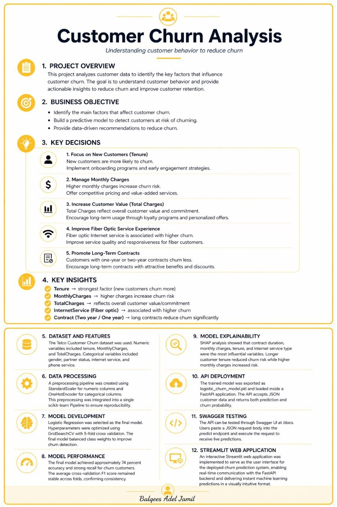

# Customer Churn Prediction API

## Overview

This project is an end-to-end **tabular machine learning product** that
predicts whether a telecom customer is likely to churn.

The solution includes: - Data cleaning and exploratory analysis -
Feature preprocessing pipeline - Logistic Regression model -
Hyperparameter tuning with GridSearchCV - Model explainability with
SHAP - FastAPI inference API - Swagger interactive testing - Serialized
model for deployment

------------------------------------------------------------------------

## Project Structure

``` bash
project/
│── api/
│   └── main.py

│── frontend/
│   └── app.py
│ 
│── data/
│   ├── processed/
│           └── clean_data.csv 
│   └── raw/
│          └── customer_churn.csv  
│── models/
│   └── logistic_churn_model.pkl
│── notebooks/
│   ├── 01_data_preparation.ipynb
│   └── 02_model_training.ipynb
│── reports/
|    └──Report.jpg
│
│── .dockerignore
│── .gitignore
│── Dockerfile
│── requirements.txt
│── README.md
```

------------------------------------------------------------------------

## Model Training

Pipeline includes:

-   `StandardScaler()` for numeric features
-   `OneHotEncoder()` for categorical features
-   `ColumnTransformer()`
-   `LogisticRegression(class_weight="balanced")`

Hyperparameter tuning:

``` python
param_grid = {
    "classifier__C": [0.01, 0.1, 1, 10],
    "classifier__solver": ["lbfgs", "liblinear"],
    "classifier__penalty": ["l2"]
}
```
The hyperparameter values were selected to explore different levels of model regularization and optimization strategies. 
The C values ranged from strong regularization (0.01) to weaker regularization (10) in order to balance underfitting and overfitting. 
Two commonly used solvers, lbfgs and liblinear, were evaluated to identify the most suitable optimization method for the dataset. 
L2 regularization was used because it is stable and widely recommended for Logistic Regression models.

Evaluation: - Accuracy ≈ 0.74 - Recall for churn ≈ 0.79 - Mean CV F1 ≈
0.63

------------------------------------------------------------------------  

## Model Comparison: Baseline vs Optimized

The baseline Logistic Regression model achieved an accuracy of 0.81 with an F1-score of 0.61 for the churn class. However, it showed limited ability to correctly identify churned customers, with a recall of 0.56.

After applying hyperparameter tuning using GridSearchCV, the optimized model achieved a slightly lower accuracy of 0.74 but significantly improved recall for the churn class (0.79). This indicates that the tuned model is more effective at identifying customers likely to churn.

Although accuracy decreased, the improvement in recall is more valuable for this business problem, where correctly identifying churned customers is critical.

Cross-validation further confirmed model stability with a mean F1-score of 0.63. 

> 💡 In churn prediction problems, recall for the positive class (churned customers) is more important than overall accuracy, because failing to identify at-risk customers leads to business loss.


------------------------------------------------------------------------

## Running the API

Start server:

``` bash
uvicorn api.main:app --reload
```

Open Swagger:

``` bash
http://127.0.0.1:8000/docs
```

------------------------------------------------------------------------

## Prediction Endpoint

### POST `/predict`

Example JSON request:

``` json
{
  "tenure": 12,
  "MonthlyCharges": 70,
  "TotalCharges": 800,
  "gender": "Female",
  "SeniorCitizen": 0,
  "Partner": "Yes",
  "Dependents": "No",
  "PhoneService": "Yes",
  "InternetService": "Fiber optic"
}
```

Example response:

``` json
{
  "prediction": 1,
  "probability_churn": 0.78
}
```

Where: - `prediction = 1` → customer likely to churn - `prediction = 0`
→ customer likely to stay

------------------------------------------------------------------------

## Testing in Swagger UI

1.  Open `/docs`
2.  Expand **POST /predict**
3.  Click **Try it out**
4.  Paste the JSON body
5.  Click **Execute**
6.  View prediction response

------------------------------------------------------------------------

## Saved Model

Model file:

``` bash
models/logistic_churn_model.pkl
```

The saved pipeline contains: - preprocessing - encoding - scaling -
classifier

------------------------------------------------------------------------

## Frontend (Streamlit UI)

A simple and modern user interface was built using Streamlit to allow
end-users to interact with the Customer Churn Prediction API.

The UI enables users to input customer information and instantly receive
real-time predictions from the trained machine learning model.

Key features of the interface:
- Clean and modern yellow-themed design
- Real-time API integration with FastAPI backend
- User-friendly input form for customer attributes
- Instant churn probability and prediction results
- Responsive and interactive layout

The frontend communicates directly with the FastAPI backend using HTTP
requests to the `/predict` endpoint.


------------------------------------------------------------------------

## How to Run the Project

### 1. Run the FastAPI Backend

Start the API server:

```bash
uvicorn api.main:app --reload
```
Then open:

http://127.0.0.1:8000/docs

Run the Streamlit Frontend

Start the user interface:

```bash
streamlit run frontend/app.py
```
Then open:

http://localhost:8501

------------------------------------------------------------------------

## Tools Used

- Python
- pandas
- numpy
- scikit-learn
- FastAPI
- Streamlit
- SHAP
- joblib
- Uvicorn

------------------------------------------------------------------------

## The application is fully containerized using Docker for reproducible deployment


## 📊 Model Report




## Author

Balqees Adel jamil
